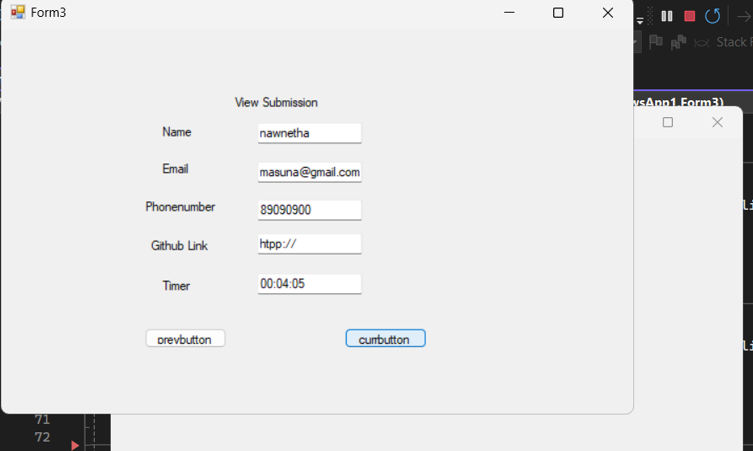

# Backend
### overview 
The project is a simple backend server built with Express.js and TypeScript. It provides endpoints to handle form submissions and retrieve specific submissions using a JSON file (db.json) as the database. The server runs locally and can be integrated with a frontend application for a complete full-stack setup.
- 

### Prerequisites
- Node.js (version >= 12.0.0)
- npm (Node Package Manager)
### Install required npm packages:
- npm install express body-parser cors fs
- npm install --save-dev typescript @types/node @types/express ts-node nodemon
### Initialize TypeScript configuration:
- tsc --init
### Install Nodemon globally
- npm install -g nodemon
### Update package.json scripts section to use Nodemon:
-  "start": "nodemon --exec ts-node src/server.ts"
### To run the server
```bash
npm start


